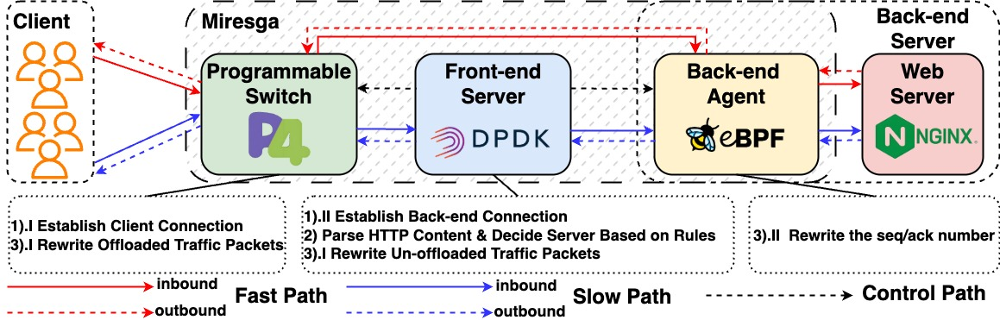

# I. Abstract

As online cloud services expand rapidly, layer-7 load balancing has become indispensable for maintaining service availability and performance. The emergence of programmable switches with both high performance and a certain degree of flexibility has made it possible to apply programmable switches to load balancing. Nevertheless, the limited memory capacity and the relatively sluggish speed of table entry insertion and deletion of programmable switches have severely constrained their performance.

To this end, we introduce Miresga, a hybrid and high-performance layer-7 load balancing system by co-designing hardware and software. The core idea of Miresga is to maximize the utilization of hardware and software resources by rationally partitioning the layer-7 load balancing task, thereby improving performance. To achieve this, Miresga offloads the elephant flows, which account for the majority of traffic, to programmable switches that excel at packet processing, and Miresga utilizes general-purpose servers with stronger computational capabilities to parse application layer protocols and apply load balancing rules. To alleviate memory pressure on the programmable switch, Miresga employs a back-end agent to handle memory-intensive tasks, working in conjunction with the programmable switch to complete the offloaded tasks. This design leverages the performance advantages of the programmable switch while avoiding bottlenecks caused by its limited memory and table insertion speed. We implement the Miresga prototype with a 3.2 Tbps Intel Tofino switch and general-purpose servers. The evaluation results show that Miresga achieves \\(3.9\times\\) throughput and \\(0.4\times\\) latency compared to software load balancing solutions. Compared to the state-of-the-art design employing programmable switches, Miresga achieves almost the same throughput and latency for delivering large objects and \\(5.0\times\\) throughput and \\(0.2\times\\) latency when transmitting small objects.

# II. Overview

Miresga is a hybrid and high-performance layer-7 load balancing system. The core idea of Miresga is to improve the performance of L7 load balancing by strategically dividing the task to maximize the use of software and hardware resources and capabilities. Through careful observation, we divide L7 load balancing into three distinct tasks: 

1. Establishing connections with clients and servers respectively.
2. Passing application layer protocols and applying load balancing rules.
3. Subsequent packet forwarding through splicing connections.

Miresga uses three components to complete these three tasks: the programmable switch, the front-end server and the back-end agent. The architecture of Miresga is shown below.

For more details, please refer to [our paper](https://dl.acm.org/doi/pdf/10.1145/3696410.3714809) and the [GitHub repository](https://github.com/THUNAME/Miresga). To run Miresga, please follow the instructions in the GitHub repository. If you have any questions, feel free to open an issue in the repository or send us an email. We will address them as soon as possible.

# III. Third-Party Dependencies

This project includes the following third-party libraries as Git submodules:

- **[cJSON](https://github.com/DaveGamble/cJSON)**
- **[libcuckoo](https://github.com/efficient/libcuckoo)**
- **[json](https://github.com/nlohmann/json)**
- **[concurrentqueue](https://github.com/cameron314/concurrentqueue)**

We sincerely appreciate the authors of these open-source libraries. Please refer to the corresponding submodule directory for checking the detailed licenses.
